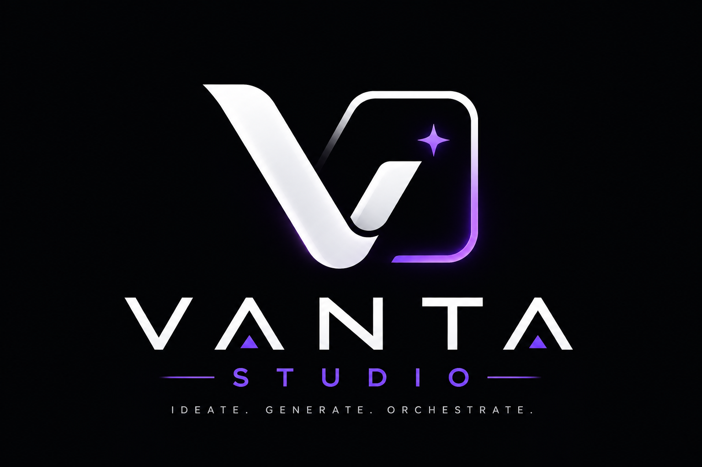
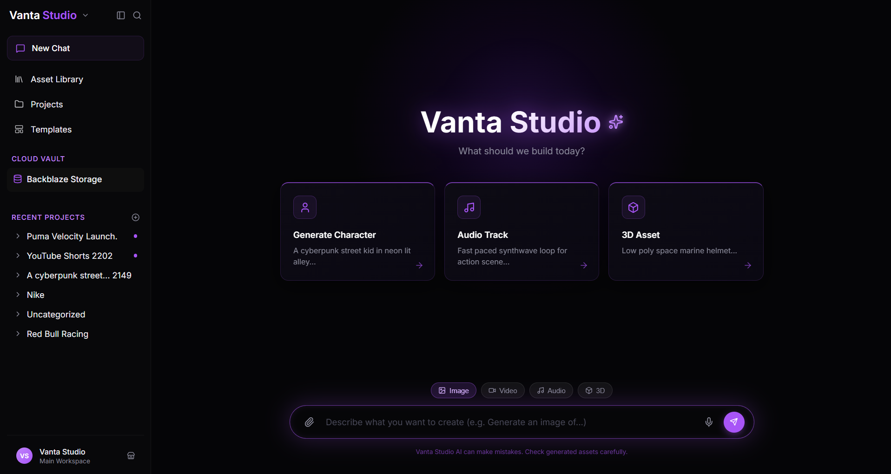

# Vanta Studio — The Unified AI Generative Media Workspace

> **"Generate images, video, audio, and 3D assets through a single chat-driven interface — with every asset automatically vaulted to Backblaze B2."**

[](#)
[](#genblaze-orchestration)
[](#live-deployment)

<p align="center">
  
</p>

---

## Table of Contents

- [🚀 Live Deployment](#-live-deployment)
- [🎬 Demo Video](#-demo-video)
- [The Problem](#the-problem)
- [The Solution](#the-solution)
- [Solution Architecture](#solution-architecture)
- [AI Providers & Models](#ai-providers--models)
- [Genblaze Orchestration Deep Dive](#genblaze-orchestration-deep-dive)
- [Backblaze B2 Integration — Proof of Usage](#backblaze-b2-integration--proof-of-usage)
- [Tech Stack](#tech-stack)
- [Local Setup & Deployment](#local-setup--deployment)
- [Project Structure](#project-structure)
- [The Grand Prize Pitch](#the-grand-prize-pitch)

---

## 🚀 Live Deployment

Vanta Studio is fully deployed and running live:

| Service | URL | Platform |
|---------|-----|----------|
| **Frontend** | [vanta-studio.vercel.app](https://vanta-studio.vercel.app) | Vercel |
| **Backend API** | [vanta-studio-api.onrender.com](https://vanta-studio-api.onrender.com) | Render |
| **Cloud Vault** | Backblaze B2 Bucket `Vanta-studio` | Backblaze |

---

## 🎬 Demo Video

[](https://youtu.be/CVEa1z9pxds)

▶️ **Watch the full demo:** https://youtu.be/CVEa1z9pxds

---

## The Problem

Creative professionals suffer from extreme tool fragmentation. To produce a single piece of polished media today, a designer must:

- Generate an **image** in Midjourney or Adobe Firefly
- Animate it into a **video** in Runway
- Record a **voiceover** in ElevenLabs
- Build a **3D asset** in Tripo3D or Meshy

Every tool has its own dashboard. Every file ends up scattered across four different web apps, local folders, and chat histories. There is no single audit trail of *what* was generated, *which prompt* created it, *which AI model* produced it, or *when* it was made.

**Generative AI has given creative professionals superpowers — but the workflow is still completely broken.**

---

## The Solution

**Vanta Studio** is a unified, chat-driven creative workspace that orchestrates best-in-class AI models behind a single interface.

<p align="center">
  
</p>

By typing a single prompt into the project chat, users can instantly generate:
- 🖼️ **Images** — powered by Pollinations.ai (Stable Diffusion / Flux)
- 🎬 **Videos** — powered by Runway Gen-4.5
- 🔊 **Audio** — powered by ElevenLabs (Rachel voice)
- 🧊 **3D Models** — powered by Tripo3D v3.1

Every single asset generated is:
1. **Automatically uploaded** to a private Backblaze B2 cloud vault
2. **Tagged with full provenance metadata** (prompt, provider, model, timestamp)
3. **Organized by project** with a pre-signed shareable URL
4. **Exportable as a ZIP bundle** directly from the UI

The result is a professional-grade AI media production pipeline with a zero-friction, chat-first UX — all backed by a **permanent, tamper-proof cloud vault**.

---

## Solution Architecture

<p align="center">
  
</p>

### Data Flow

```
User Prompt → React Chat UI
                    │
                    ▼
         FastAPI Backend (Python)
                    │
         ┌──────────┴──────────────┐
         │   Genblaze Orchestrator  │
         └──────────┬──────────────┘
                    │ Routes by media_type
        ┌───────────┼──────────────┬──────────────┐
        ▼           ▼              ▼              ▼
   Runway Gen-4.5  ElevenLabs  Tripo3D v3.1  Pollinations
   (Video)         (Audio)     (3D .glb)     (Image)
        │           │              │              │
        └───────────┴──────────────┴──────────────┘
                    │ Raw Bytes + Metadata
                    ▼
         Backblaze B2 Storage (boto3 / S3-compat)
         ├── projects/{name}/assets/{file}.mp4
         ├── projects/{name}/assets/{file}.mp3
         ├── projects/{name}/assets/{file}.glb
         ├── projects/{name}/assets/{file}.png
         └── projects/{name}/assets/{file}.json  ← Provenance Metadata
                    │
                    ▼
         Pre-signed URL returned to UI
         Asset displayed in Project Chat + Asset Library
```

### Architecture Highlights

- **Stateless Frontend**: The React app holds zero local state for assets. Everything is fetched from B2 via the backend API with fresh pre-signed URLs on every load.
- **Async Polling**: Video (Runway) and 3D (Tripo3D) use non-blocking `asyncio` polling loops — the backend waits patiently without blocking other requests.
- **B2 as Ground Truth**: `projects.json` stored directly in B2 acts as the project index. Deleting the app doesn't delete your work — it's permanently vaulted.

---

## AI Providers & Models

| Media Type | Provider | Model | API Key Required |
|------------|----------|-------|-----------------|
| 🖼️ **Image** | Pollinations.ai | Stable Diffusion / Flux-based | ❌ Free |
| 🎬 **Video** | RunwayML | `gen4.5` (text-to-video) | ✅ `RUNWAY_API_KEY` |
| 🔊 **Audio** | ElevenLabs | `eleven_monolingual_v1` | ✅ `ELEVENLABS_API_KEY` |
| 🧊 **3D Model** | Tripo3D | `v3.1-20260211` | ✅ `TRIPO_API_KEY` |

All generation workflows are fully asynchronous. The UI shows a premium animated skeleton loader with shimmer effects while assets are being generated — never a frozen screen.

---

## Genblaze Orchestration Deep Dive

The core of Vanta Studio's AI pipeline is `backend/services/genblaze_client.py` — a single orchestration class (`GenblazeOrchestrator`) that routes natural language prompts to the appropriate AI provider based on the requested `media_type`.

### How it works

1. The user submits a prompt in the chat UI and selects a media type (`image`, `video`, `audio`, `3d`).
2. The FastAPI `/api/generate` endpoint receives the `GenerateRequest` and calls the orchestrator.
3. The orchestrator initializes the provider client:
   - **Image**: Direct HTTP GET to Pollinations.ai URL with encoded prompt.
   - **Audio**: HTTP POST to ElevenLabs `/v1/text-to-speech` with voice ID and stability settings.
   - **Video**: `AsyncRunwayML` SDK call with `gen4.5` model, `1280:720` ratio, 5-second duration.
   - **3D**: HTTP POST to Tripo3D `/v3/generation/text-to-model`, followed by polling `/v3/tasks/{task_id}`.
4. For async providers (Video/3D), the orchestrator enters a non-blocking `await asyncio.sleep` polling loop, monitoring task status until `"success"` or `"failed"`.
5. Raw binary bytes are downloaded directly into memory — no temp files, no disk writes.
6. A standardized dict is returned containing `media_bytes` and `metadata` (prompt, provider, model, source URL, timestamp).

### Proof of Integration (Orchestrator Code)

```python
# backend/services/genblaze_client.py (Video workflow)
task = await self.runway_client.text_to_video.create(
    model='gen4.5',
    prompt_text=prompt,
    ratio='1280:720',
    duration=5
)
# Non-blocking async poll loop
while True:
    task_status = await self.runway_client.tasks.retrieve(task_id)
    if task_status.status in ['SUCCEEDED', 'FAILED']:
        break
    await asyncio.sleep(5)

# 3D workflow (Tripo3D)
resp = await client.post(
    "https://openapi.tripo3d.ai/v3/generation/text-to-model",
    headers={"Authorization": f"Bearer {self.tripo_key}"},
    json={"prompt": prompt, "model": "v3.1-20260211"},
    timeout=30.0
)
task_id = resp.json()["data"]["task_id"]
```

---

## Backblaze B2 Integration — Proof of Usage

Backblaze B2 is not a secondary storage option in Vanta Studio — **it IS the database**. There is no SQL, no Redis, no Firebase. B2 is the single source of truth for every asset, every project, and every piece of provenance metadata.

### The B2 Workflow (Step-by-Step)

```
1. GenblazeOrchestrator returns raw bytes + metadata dict
         │
         ▼
2. FastAPI router calls b2_service.upload_file_bytes()
   → boto3 S3-compatible PUT to B2 bucket
   → Key: projects/{project_name}/assets/generation_{timestamp}.mp4
         │
         ▼
3. A 24-hour pre-signed URL is generated via generate_presigned_url()
   → Returned to React frontend for immediate display
         │
         ▼
4. b2_service.upload_metadata() stores JSON sidecar file:
   → Key: projects/{project_name}/assets/generation_{timestamp}.json
   → Contains: prompt, provider, model, media_key, media_url, created_at
         │
         ▼
5. projects.json index in B2 root is updated
   → The entire project list lives in B2, not in any local DB
```

### Proof of B2 Integration (Storage Code)

```python
# backend/services/b2_storage.py
self.s3_client = boto3.client(
    service_name='s3',
    endpoint_url=self.endpoint,              # https://s3.us-east-005.backblazeb2.com
    aws_access_key_id=self.key_id,
    aws_secret_access_key=self.application_key,
    config=Config(signature_version='s3v4')  # B2 S3-compatible
)

# Upload raw media bytes
self.s3_client.put_object(
    Bucket=self.bucket_name,   # "Vanta-studio"
    Key=object_name,           # "projects/Nike/assets/generation_1754229600.mp4"
    Body=file_bytes,
    ContentType=content_type
)

# Generate 24-hour pre-signed URL
url = self.s3_client.generate_presigned_url(
    ClientMethod='get_object',
    Params={'Bucket': self.bucket_name, 'Key': object_name},
    ExpiresIn=86400
)
```

### Why B2 Solves a Real Problem

| Without B2 | With Vanta Studio + B2 |
|------------|------------------------|
| Assets die when you close the browser tab | Assets live forever in your private cloud vault |
| No audit trail of AI generations | Full provenance JSON stored alongside every file |
| Files scattered across 4 apps | Single organized bucket with project folders |
| No sharing capability | Pre-signed URLs for instant sharing |
| No bulk export | ZIP download of entire project from B2 |

---

## Tech Stack

| Layer | Technology | Purpose |
|-------|-----------|---------|
| **Frontend** | React 19 + Vite 8 | Chat UI, Asset Gallery, Project Management |
| **Styling** | Vanilla CSS (custom) | Dark mode glassmorphism, custom animations |
| **Backend** | FastAPI (Python) | REST API, async orchestration |
| **AI Middleware** | `runwayml` SDK + `httpx` | Multi-provider AI routing (Genblaze pattern) |
| **Cloud Storage** | Backblaze B2 via `boto3` | Primary asset vault and project database |
| **Deployment** | Render (backend) + Vercel (frontend) | Live production environment |
| **Environment** | `python-dotenv` | Secure key management |

---

## Local Setup & Deployment

### Prerequisites

| Requirement | Version |
|-------------|---------|
| Node.js | v18+ |
| Python | 3.11+ |
| Backblaze B2 Account | Any tier |

### Step 1: Clone & Install

```bash
git clone https://github.com/Nexorax-nk/Vanta-Studio.git
cd Vanta-Studio

# Install Backend Dependencies
cd backend
pip install -r requirements.txt

# Install Frontend Dependencies
cd ../frontend
npm install
```

### Step 2: Configure Environment

Create `backend/.env` with your credentials:

```env
# Backblaze B2 Credentials (Required)
B2_KEY_ID="your_b2_key_id"
B2_APPLICATION_KEY="your_b2_application_key"
B2_BUCKET_NAME="your-bucket-name"
B2_ENDPOINT="https://s3.us-east-005.backblazeb2.com"

# AI Provider Keys (Required for respective media types)
RUNWAY_API_KEY="your_runway_api_key"
ELEVENLABS_API_KEY="your_elevenlabs_api_key"
TRIPO_API_KEY="your_tripo_api_key"
```

> ⚠️ **Note**: Image generation works with zero API keys. Only B2 keys are strictly required to run the full app with cloud persistence.

### Step 3: Start the Studio

```bash
# Terminal 1 — Backend (from /backend)
python -m uvicorn main:app --reload
# API running at http://localhost:8000

# Terminal 2 — Frontend (from /frontend)
npm run dev
# UI running at http://localhost:5173
```

Open **http://localhost:5173** in your browser and start generating!

---

## Project Structure

```
Vanta-Studio/
├── backend/
│   ├── main.py                     # FastAPI entrypoint + CORS
│   ├── requirements.txt            # Python dependencies
│   ├── api/
│   │   └── routes.py               # All API endpoints (generate, projects, export)
│   └── services/
│       ├── genblaze_client.py      # AI Orchestrator (Runway, ElevenLabs, Tripo, Pollinations)
│       └── b2_storage.py           # Backblaze B2 Storage Service (boto3)
│
└── frontend/
    ├── index.html
    ├── package.json
    ├── vite.config.js
    └── src/
        ├── App.jsx                 # Root routing and state
        ├── index.css               # Global design system
        ├── components/
        │   ├── Sidebar.jsx         # Project navigation sidebar
        │   ├── ProjectModal.jsx    # New project creation modal
        │   └── MainArea.jsx        # Content area layout
        └── views/
            ├── WelcomeView.jsx     # Landing screen
            ├── ProjectChat.jsx     # ⭐ AI generation chat interface
            ├── AssetLibrary.jsx    # Asset gallery with media preview
            ├── TemplatesView.jsx   # Quick-start template gallery
            ├── ExportView.jsx      # ZIP + JSON + shareable link export
            ├── CloudVault.jsx      # Backblaze B2 vault stats dashboard
            └── SettingsView.jsx    # API keys and configuration panel
```

---

## The Grand Prize Pitch

> *"Generative AI has given creative professionals superpowers — but the workflow is completely broken. We built Vanta Studio to fix that.*
>
> *Every creative professional in 2026 is juggling four different AI apps, four different accounts, four different storage silos, and zero audit trails. The best AI models in the world are being used through a workflow that belongs in 2015.*
>
> *Vanta Studio collapses the entire creative pipeline — image, video, audio, and 3D — into a single, beautiful, chat-driven interface. And underneath it all, Backblaze B2 acts as the permanent, tamper-proof source of truth: not just as storage, but as the actual database.*
>
> *We didn't bolt B2 on at the end. We architected around it from day one. There is no SQL database. There is no Redis cache. B2 IS the project management system. Every asset, every prompt, every model version — permanently vaulted, provenance-tagged, and instantly shareable via pre-signed URLs.*
>
> *This is what a modern AI creative studio looks like."*

---

**Vanta Studio** | Backblaze Generative Media Hackathon 2026 | Team: Nexorax
