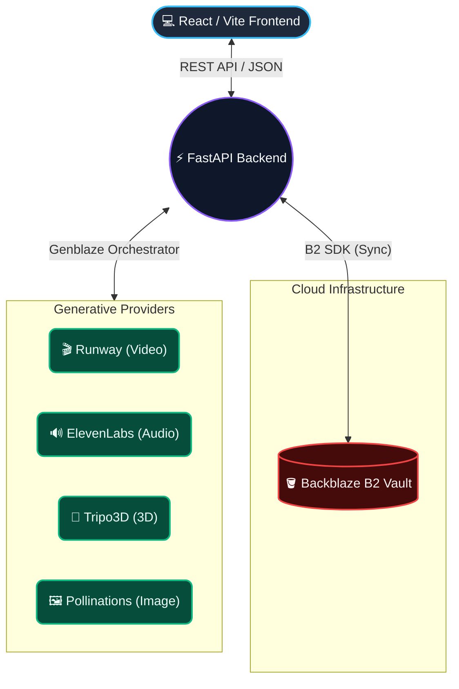

# Vanta Studio — The agentic creative workspace that transforms ideas into production-ready AI media

> **"Vanta Studio brings images, video, audio, and 3D generation into a single, unified local environment backed by cloud storage."**

[](#)
[](#)
[](#backblaze-b2-storage-integration)

---

## Table of Contents

- [The Vision](#the-vision)
- [Architecture](#architecture)
- [AI Providers & Models](#ai-providers--models)
- [Genblaze Orchestration](#genblaze-orchestration)
- [Backblaze B2 Storage Integration](#backblaze-b2-storage-integration)
- [Local Setup & Execution](#local-setup--execution)

---

## The Vision

Creative professionals currently suffer from extreme fragmentation. You generate an image in Midjourney, animate it in Runway, create voiceovers in ElevenLabs, and construct 3D assets in Tripo3D. Your files are scattered across four different web apps, local folders, and chat histories. 

**Vanta Studio** solves this by providing a unified, chat-driven workspace that orchestrates best-in-class AI models behind a single interface. Every asset generated is automatically tracked, metadata is preserved, and everything is seamlessly synced to your own secure cloud vault using Backblaze B2.

---

## Architecture

Vanta Studio is built on a modern, decoupled stack prioritizing speed and extensible AI integrations.



---

## AI Providers & Models

Vanta Studio uses a specialized **Genblaze Orchestrator** to route natural language prompts to the most capable models for the requested media type. 

| Media Type | Provider | Model | Authentication |
|------------|----------|-------|----------------|
| **Image** | Pollinations.ai | Stable Diffusion / Flux based | Free (No API Key) |
| **Video** | RunwayML | Gen-4.5 | `RUNWAY_API_KEY` |
| **Audio** | ElevenLabs | eleven_monolingual_v1 (Rachel) | `ELEVENLABS_API_KEY` |
| **3D Model** | Tripo3D | v3.1-20260211 | `TRIPO_API_KEY` |

All generation workflows are fully asynchronous, ensuring the UI remains responsive while heavy rendering tasks run in the background.

---

## Genblaze Orchestration

The orchestration layer is handled by `genblaze_client.py`. It is responsible for translating the user's intent from the chat interface into API-specific payloads, managing long-polling and async webhooks for providers that require it (like Runway and Tripo3D), and standardizing the output.

**How it works:**
1. The user requests an asset in the chat (e.g., *"Generate a 3D model of a cybernetic eye"*).
2. The FastAPI backend identifies the requested media type.
3. The Genblaze Orchestrator initializes the provider client (e.g., `AsyncRunwayML` or `httpx` for Tripo).
4. For async APIs (Video/3D), the orchestrator initiates the task and drops into a non-blocking `asyncio.sleep` polling loop to monitor task completion.
5. Once complete, the orchestrator downloads the raw binary payload directly into memory.
6. A standardized dictionary containing the `media_bytes` and full `metadata` (prompt, provider, model, original source URL) is returned to the router.

This abstraction means the frontend never needs to know *how* an asset was generated, only that an asset is ready.

---

## Backblaze B2 Storage Integration

Local storage is fragile. Generative media files (especially 4K video and 3D models) are massive. Vanta Studio solves this by using **Backblaze B2** as the primary source of truth for your asset library. 

The `b2_storage.py` service seamlessly bridges the gap between local generation and cloud persistence.

**The B2 Workflow:**
1. When Genblaze finishes generating an asset, the raw bytes are passed to the B2 service.
2. The file is written to the local `/data/{project_name}` cache for immediate UI rendering.
3. Simultaneously, a background task uploads the file to the configured Backblaze B2 Bucket (`Vanta-studio`), organized into virtual directories by project name.
4. Extensive provenance metadata (prompt, provider, timestamp, media type) is attached directly to the B2 object as custom `X-Bz-Info-*` metadata headers. 
5. The Cloud Vault UI queries the `/api/vault/stats` endpoint, which scans the B2 bucket to calculate total storage used, project count, and fetches recent uploads directly from the cloud.

This guarantees that even if you wipe your local environment, your entire creative history, along with the prompts used to generate them, is safely preserved in Backblaze.

---

## Local Setup & Execution

### Prerequisites

| Requirement | Version |
|-------------|---------|
| Node.js | v18+ |
| Python | 3.11+ |

### Step 1: Clone and Install

```bash
git clone https://github.com/Nexorax-nk/Vanta-Studio.git
cd Vanta-Studio

# Install Backend
cd backend
pip install -r requirements.txt

# Install Frontend
cd ../frontend
npm install
```

### Step 2: Configure Environment

```bash
cd backend
cp .env.example .env
```

Open `.env` and configure your API keys. *Note: Only B2 keys are strictly required to start the app. Image generation works without a key.*

```env
# Backblaze B2 Credentials
B2_KEY_ID="your_b2_key_id"
B2_APPLICATION_KEY="your_b2_application_key"
B2_BUCKET_NAME="Vanta-studio"
B2_ENDPOINT="https://s3.us-east-005.backblazeb2.com"

# AI Provider Credentials
RUNWAY_API_KEY="your_runway_key"
ELEVENLABS_API_KEY="your_elevenlabs_key"
TRIPO_API_KEY="your_tripo_key"
```

### Step 3: Start the Studio

Run the backend (from the `backend` folder):
```bash
python -m uvicorn main:app --reload
```

Run the frontend (from the `frontend` folder):
```bash
npm run dev
```

Open **http://localhost:5173** in your browser to access Vanta Studio.

---

**Vanta Studio** | Band of Agents Hackathon 2026 | Team: Nexorax
